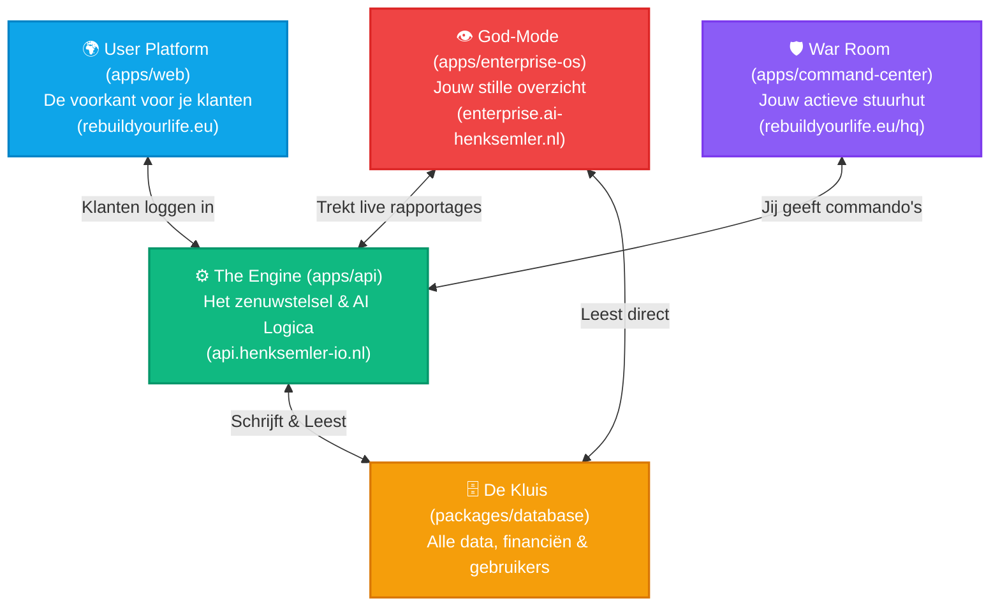

# RebuildYourLife 2026: Het Volledige Ecosysteem

Je hebt nu een gigantisch, professioneel gebouwd *Monorepo* (een mega-kluis) waar al jouw applicaties in wonen. Ze praten allemaal met elkaar, maar hebben hun eigen, strikt gescheiden doelen.

Hier is precies wat er allemaal in jouw systeem hangt en wat het doet:

---

## 1. De Drie Voorkanten (Voor wie zijn ze?)

### 🌍 1. Het Gebruikersplatform (`apps/web`)
**Voor wie:** Je Klanten, Leads & Je Klantenservice/Basis-beheer.
**Wat is dit:** Dit is je commerciële platform (rebuildyourlife.eu). Hier komen mensen met schulden, kopen ze toegang, en loggen ze in op hun dashboard.
**De Admin Pagina:** Binnen dit platform zit ook nog de `/admin` pagina. Dit is de traditionele backend waar je 'gewone' klantgegevens kunt inzien zonder God-Mode of AI-features. Gewoon een strak, simpel CRM voor de dagelijkse klantenservice.
**Waarom:** Zonder dit, heb je geen inkomsten. Dit platform is 100% gericht op het verkopen van jouw visie en het helpen van de klant. Het bevat geen enkele hint van "God-Mode".

### 🛡️ 2. De War Room / Control Center (`apps/command-center`)
**Voor wie:** Voor jou als Actieve Commandant.
**Wat is dit:** De donkere, sci-fi omgeving met de "Terminal", de AI-Hologram en de pratende assistent. Hier ga je in als je direct de handen uit de mouwen wilt steken. Hier "praat" je tegen de AI om ze taken te geven (bijv. "Zoek 100 leads").
**Waarom:** Voor snelle, agressieve acties, experimenten, en het direct aansturen van agenten.

### 👁️ 3. Enterprise OS / God-Mode (`apps/enterprise-os`)
**Voor wie:** Voor jou als Supreme Overseer / CEO.
**Wat is dit:** De superstrakke, stille omgeving die we zojuist gebouwd hebben. Geen chatscherm, geen drukte. Alleen harde cijfers, een Kill Switch, en de C-Level Board of Directors die alles op de achtergrond checken.
**Waarom:** Voor wanneer je overzicht wilt. Hier check je je geld, valideer je de beslissingen van de AI (Action Queue), en bekijk je de "Black Box" zonder dat de AI tegen je praat.

---

## 2. De Twee Achterkanten (De Motor)

### ⚙️ 4. De AI Engine & API (`apps/api`)
**Wat is dit:** Dit is het hart van je bedrijf. Het is een zwaar beveiligde Node.js server. 
**Wat doet het:** 
- Het verbindt Mollie zodat klanten kunnen betalen.
- Het stuurt de AI-agenten aan (het geeft ze toegang tot internet of mail).
- Het controleert of jij de "God-Mode" status hebt ingelogd voordat het de Kill Switch activeert.

### 🗄️ 5. De Database & Kluis (`packages/database`)
**Wat is dit:** Jouw eigen PostgreSQL database (gebouwd met Prisma).
**Wat zit erin:** 
- Geregistreerde gebruikers (klanten en jijzelf).
- Alle betalingen, facturen, en budgetten.
- De "Audit Log" (wat heeft de AI vandaag uitgespookt?).
- De status van al je domeinen en agenten.

---

## Waarom is deze opzet zo extreem krachtig?
Doordat we dit gescheiden hebben, kan de AI in theorie het **Gebruikersplatform** helemaal zelf aanpassen (via de Webbuilder), zónder dat het ooit per ongeluk jouw **War Room** of **God-Mode** kan breken. De AI heeft toegang tot laag 1, maar jij zit in laag 3 veilig afgeschermd.

---

## 3. Master Toegang (Single Sign-On)
Omdat alle 3 de platformen praten met dezelfde database, heb je maar 1 account nodig voor de volledige controle.

**Master Account (God-Mode / Admin / War Room):**
*   **E-mail:** `admin@rebuildyourlife.eu`
*   **Wachtwoord:** `Imperialdreams2055`
*   **Rol:** `SUPREME_OVERSEER` (Level 5 Toegang)
