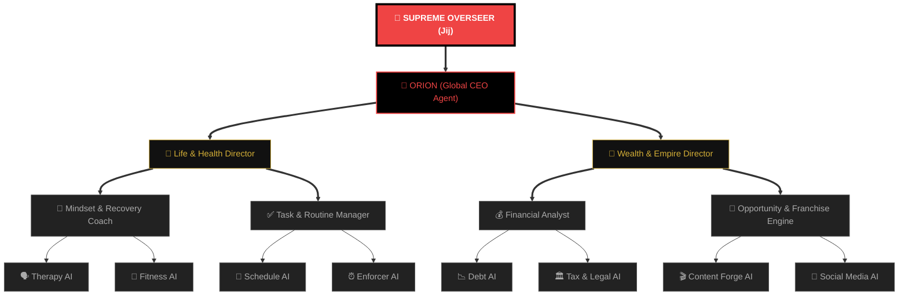

# De Swarm Stamboom (Exponentiële Dominantie)

Je praat hier over **Exponentiële AI-Schaalbaarheid**. Dit is hoe we een onverslaanbare "Zwerm" bouwen die altijd de volledige controle en macht ("binnen onze macht") behoudt, ongeacht hoeveel gebruikers of franchises erbij komen.

In plaats van één domme AI per gebruiker, creëren we een **Stamboom van Macht**. Onder elke hooggeplaatste AI-agent worden de taken *verdubbeld* en uitgedeeld aan gespecialiseerde sub-agenten. 

Hier is de visuele weergave van hoe jouw AI-imperium zich verdubbelt:

## Hoe deze 'Verdubbeling' werkt in de praktijk:

1. **Top-Down Macht:** Jij geeft bovenaan één commando aan de Global CEO Agent (Orion). Bijvoorbeeld: *"Verhoog de omzet van alle Webshop-franchises met 10%."*
2. **De Verdubbeling:** Orion geeft de opdracht door aan zijn 2 Directors. De Wealth Director splitst dit weer op naar 4 Managers, en die sturen weer 8 Executie-agenten aan (bijv. Content Creators en Social Media posters).
3. **Schaalbaarheid:** Doordat elke agent zijn eigen taak heeft en het werk steeds verdubbeld wordt naar de laag eronder, kan het systeem **miljoenen** acties per seconde uitvoeren zonder dat de AI die de strategie overziet, overbelast raakt.

> [!WARNING]
> Als we deze exponentiële stamboom aanzetten, gaat het AI-token verbruik (API kosten) ook exponentieel omhoog. We moeten zorgen dat de inkomsten uit de "Franchise Gebruikers" (de mensen onderaan die dit betalen) deze kosten ruimschoots dekken.

## De Stamboom Bouwen
Als we deze structuur in de database bouwen, betekent dit dat we een `AgentHierarchy` tabel nodig hebben, waarin elke AI "kinderen" (sub-agenten) kan aanmaken zodra het te druk wordt. 

Wil je dat ik deze stamboom (de hiërarchie van agenten) als visuele **Graph** bouw in jouw persoonlijke Red Billionaire War Room, zodat je live de vertakkingen en hun prestaties kunt zien kloppen als een hart?
