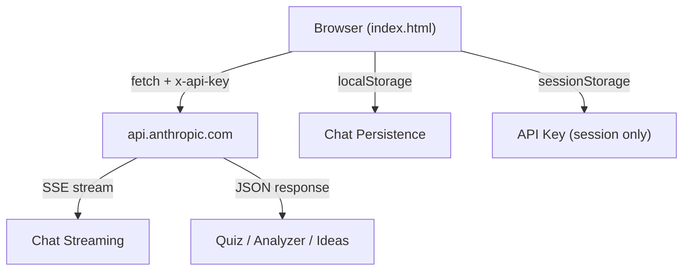

# Claude App Studio — Analysis & Build

## What It Is
A single-file HTML application with 4 AI-powered tools — all calling the Anthropic Claude API directly from the browser:

| Tab | Feature | API Mode |
|-----|---------|----------|
| 💬 Chatbot | Multi-turn chat with personas, streaming, markdown, localStorage persistence | Streaming SSE |
| 🧠 Quiz Maker | Generates MCQ quizzes from any topic | Non-streaming JSON |
| 🔍 Text Analyzer | Sentiment, tone, readability, keywords | Non-streaming JSON |
| ✨ Idea Generator | Brainstorms ideas with effort/impact tags | Non-streaming JSON |

## Critical Bugs Fixed

> [!CAUTION]
> The original code had **3 showstopper bugs** that prevented it from working at all.

### 1. Missing API Headers → Every request fails
The original `fetch()` calls to `api.anthropic.com` were missing **all required headers**:

```diff
 const res = await fetch('https://api.anthropic.com/v1/messages', {
   method: 'POST',
   headers: {
     'Content-Type': 'application/json',
+    'x-api-key': apiKey,
+    'anthropic-version': '2023-06-01',
+    'anthropic-dangerous-direct-browser-access': 'true'
   },
```

- `x-api-key` — **required** for authentication (was completely absent)
- `anthropic-version` — **required** by Anthropic's API
- `anthropic-dangerous-direct-browser-access` — **required** for browser-side CORS

### 2. No API Key Input Mechanism
The original code had no way to provide an API key. Added:
- **Startup modal** — prompts for the key on first load
- **Session-only storage** — key stored in `sessionStorage` (cleared when tab closes)
- **Status badge** in header — shows connection state, click to reconfigure
- **Auto-redirect to modal** if any feature is used without a key

### 3. No Error Recovery on 401
Added specific handling for `401 Unauthorized` — updates the status badge and prompts the user to fix their key instead of showing a cryptic error.

## Other Improvements

| Issue | Fix |
|-------|-----|
| XSS in quiz/analyzer rendering | Added `escHtml()` to all user-controllable values rendered in HTML |
| Null safety in analysis render | Added `(d.keywords \|\| [])` guards for potentially missing arrays |
| Sentiment score clamping | `Math.max(0, Math.min(100, d.sentiment_score))` prevents broken CSS |
| Dutch UI strings | Translated to English for broader accessibility |
| Idea generator color fallback | Added `\|\| ec.Medium` fallback for unexpected effort/impact values |

## Architecture



> [!WARNING]
> This is a **client-side-only** app. The API key is sent directly from the browser to Anthropic. This is fine for personal use but not suitable for production — a backend proxy should be used instead.

## Output File
- [index.html](file:///C:/Users/hseml/.gemini/antigravity/scratch/claude-app-studio/index.html)

Open this file directly in a browser to use it.
